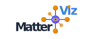
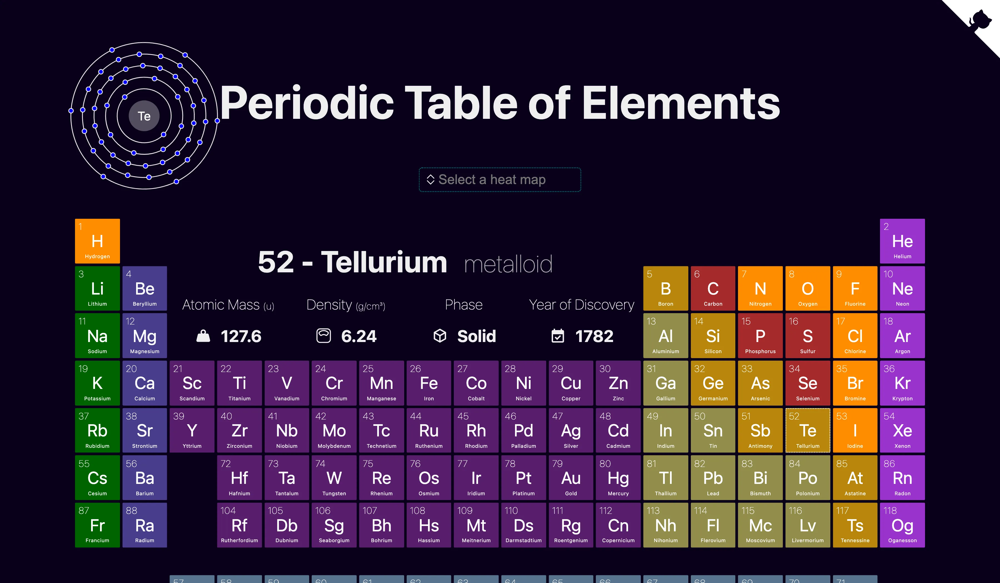
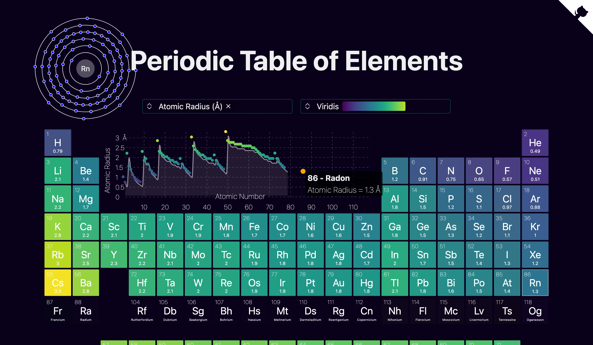

<h1 align="center">
  
</h1>

<h4 align="center">

[](https://github.com/janosh/matterviz/actions/workflows/test.yml)
[](https://github.com/janosh/matterviz/actions/workflows/gh-pages.yml)
[](https://results.pre-commit.ci/latest/github/janosh/matterviz/main?badge_token=nUqJfPCFS4uyMwcFSDIfdQ)
[](https://stackblitz.com/github/janosh/matterviz)

</h4>

`matterviz` is a toolkit for building interactive web UIs for materials science: periodic tables, 3d crystal structures (and molecules, though needs some improvements!), Bohr atoms, nuclei, heatmaps, scatter plots. It's under active development and not yet ready for production use but we appreciate any feedback from beta testers! 🙏



## 📦 &thinsp; Heatmap

This screenshot demonstrates the periodicity of elemental properties (i.e. why it's called periodic table). In this case, you're seeing recurring bumps and valleys in the first ionization energy as a function of atomic number.



## ⚛️ &thinsp; 3D Structure Viewer


## ⚛️ &thinsp; Element Details Pages

The details page for gold.

<https://user-images.githubusercontent.com/30958850/186975855-8e0d94f9-e4e3-47a2-9354-9c012b37307c.mp4>

## 🔨 &thinsp; Installation

```sh
npm install --dev matterviz
```

## 📙 &thinsp; Usage

Import the `PeriodicTable` component and pass it some heatmap values:

```svelte
<script>
  import { PeriodicTable } from 'matterviz'

  const heatmap_values = { H: 10, He: 4, Li: 8, Fe: 3, O: 24 }
</script>

<PeriodicTable {heatmap_values} />
```

## 🎬 &thinsp; Events

`PeriodicTable.svelte` forwards the following events from each `ElementTile`:

1. `click`
1. `mouseenter`
1. `mouseleave`
1. `keyup`
1. `keydown`

Each event is a Svelte `dispatch` event with the following `detail` payload:

```ts
detail: {
  element: ChemicalElement
  active: boolean // whether the event target tile is currently active
  dom_event: Event // the DOM event that triggered the Svelte dispatch
}
```

See `DispatchPayload` and `PeriodicTableEvents` in `src/lib/index.ts`

## 🧪 &thinsp; Coverage

| Statements                                                                                 | Branches                                                                          | Lines                                                                            |
| ------------------------------------------------------------------------------------------ | --------------------------------------------------------------------------------- | -------------------------------------------------------------------------------- |
|  |  |  |

## 🙏 &thinsp; Acknowledgements

- Element properties in `src/lib/element-data.ts` were combined from [`Bowserinator/Periodic-Table-JSON`](https://github.com/Bowserinator/Periodic-Table-JSON/blob/master/PeriodicTableJSON.json) under Creative Commons license and [`robertwb/Periodic Table of Elements.csv`](https://gist.github.com/robertwb/22aa4dbfb6bcecd94f2176caa912b952) (unlicensed).
- Thanks to [Images of Elements](https://images-of-elements.com) for providing photos of elemental crystals and glowing excited gases.
- Thanks to [@kadinzhang](https://github.com/kadinzhang) and their [Periodicity project](https://ptable.netlify.app) [[code](https://github.com/kadinzhang/Periodicity)] for the idea to display animated Bohr model atoms and inset a scatter plot into the periodic table to visualize the periodic nature of elemental properties.
- Big thanks to all sources of element images. See [`fetch-elem-images.ts`](https://github.com/janosh/matterviz/blob/-/src/fetch-elem-images.ts) and [`static/elements`](https://github.com/janosh/matterviz/tree/main/static/elements).
- Thanks to [@ixxie](https://github.com/ixxie) ([shenhav.fyi](https://shenhav.fyi)) for a lot of great suggestions, UX ideas, helping me learn [`threlte`](https://threlte.xyz) and contributing the [`Bond.svelte`](https://github.com/janosh/matterviz/blob/-/src/lib/structure/Bond.svelte) component.

This project would not have been possible as a one-person side project without many fine open-source projects. 🙏 To name just a few:

|           3D graphics           |               2D graphics                |                     Docs                     |               Bundler               |               Testing                |
| :-----------------------------: | :--------------------------------------: | :------------------------------------------: | :---------------------------------: | :----------------------------------: |
| [three.js](https://threejs.org) |          [d3](https://d3js.org)          |         [mdsvex](https://mdsvex.com)         |     [vite](https://vitejs.dev)      | [playwright](https://playwright.dev) |
| [threlte](https://threlte.xyz)  | [sharp](https://sharp.pixelplumbing.com) | [rehype](https://github.com/rehypejs/rehype) | [sveltekit](https://kit.svelte.dev) |     [vitest](https://vitest.dev)     |
