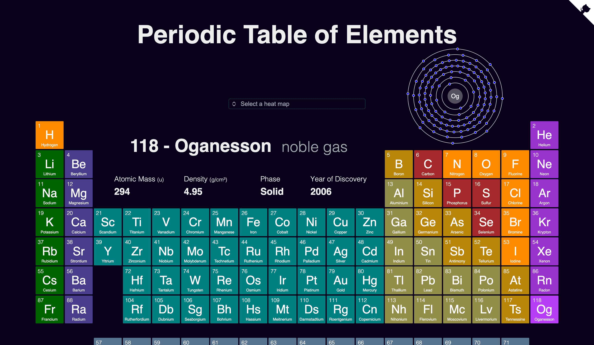
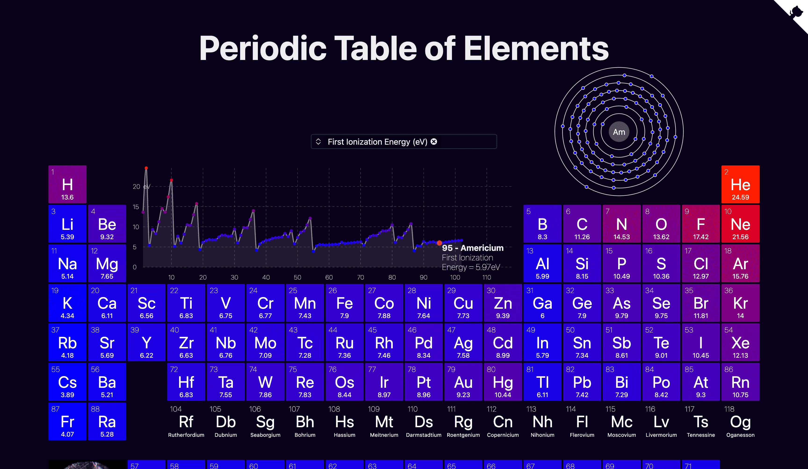

<h1 align="center">
  
  <br>
  Periodic Table
</h1>

<h4 align="center">

[](https://github.com/janosh/periodic-table/actions/workflows/test.yml)
[](https://github.com/janosh/periodic-table/actions/workflows/gh-pages.yml)
[](https://results.pre-commit.ci/latest/github/janosh/periodic-table/main?badge_token=nUqJfPCFS4uyMwcFSDIfdQ)
[](https://stackblitz.com/github/janosh/periodic-table)

</h4>

Interactive Periodic Table component written in Svelte. With scatter plot showing periodicity of elemental properties and Bohr atoms showing electron shell configuration of different elements.



## 📊 &thinsp; Heatmap

Below a screenshot demonstrating the periodicity of elemental properties, i.e. why the periodic table is called periodic. In this case its showing recurring bumps and valleys in the first ionization energy as a function of atomic number.



## ⚛️ &thinsp; Element Details Pages

The details page for gold.

<https://user-images.githubusercontent.com/30958850/186975855-8e0d94f9-e4e3-47a2-9354-9c012b37307c.mp4>

## 🔨 &thinsp; Installation

```sh
npm install --dev periodic-tables
```

## 📙 &thinsp; Usage

Import the `PeriodicTable` component and pass it some heatmap values:

```svelte
<script>
  import PeriodicTable from 'periodic-tables'

  const heatmap_values = { H: 10, He: 4, Li: 8, Fe: 3, O: 24 }
</script>

<PeriodicTable {heatmap_values} />
```

## 🧪 &thinsp; Coverage

| Statements                                                                                 | Branches                                                                          | Lines                                                                            |
| ------------------------------------------------------------------------------------------ | --------------------------------------------------------------------------------- | -------------------------------------------------------------------------------- |
|  |  |  |

## 🙏 &thinsp; Acknowledgements

- Element properties in `src/lib/element-data.ts` were combined from [`Bowserinator/Periodic-Table-JSON`](https://github.com/Bowserinator/Periodic-Table-JSON/blob/master/PeriodicTableJSON.json) under Creative Commons license and [`robertwb/Periodic Table of Elements.csv`](https://gist.github.com/robertwb/22aa4dbfb6bcecd94f2176caa912b952) (unlicensed).
- Thanks to [Images of Elements](https://images-of-elements.com) for providing photos of elemental crystals and glowing excited gases.
- Thanks to [@kadinzhang](https://github.com/kadinzhang) and their [Periodicity project](https://ptable.netlify.app) [[code](https://github.com/kadinzhang/Periodicity)] for the idea to display animated Bohr model atoms and inset a scatter plot into the periodic table to visualize the periodic nature of elemental properties.
