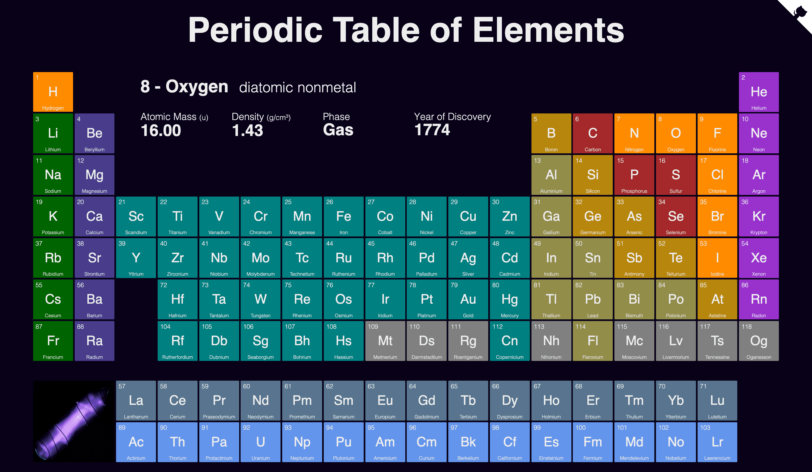

# Periodic Table

[](https://app.netlify.com/sites/periodic-table/deploys)
[](https://results.pre-commit.ci/latest/github/janosh/periodic-table/main?badge_token=nUqJfPCFS4uyMwcFSDIfdQ)

A dynamic Periodic Table component written in Svelte.



## Usage

Copy the `src/lib/` folder into your Svelte project and import the `PeriodicTable` component:

```svelte
<script>
  import PeriodicTable from 'src/components/PeriodicTable.svelte'
</script>

<PeriodicTable />
```

## Want to contribute?

Clone the repo, install dependencies and start the dev server to try out your changes.

```sh
git clone https://github.com/janosh/periodic-table
cd periodic-table
yarn
yarn dev
```

## Acknowledgements

1. Element properties in `src/lib/periodic-table-data.ts` were combined from [`Bowserinator/Periodic-Table-JSON`](https://github.com/Bowserinator/Periodic-Table-JSON/blob/master/PeriodicTableJSON.json) under Creative Commons license and [`robertwb/Periodic Table of Elements.csv`](https://gist.github.com/robertwb/22aa4dbfb6bcecd94f2176caa912b952) (unlicensed).
1. Thanks to [Images of Elements](https://images-of-elements.com) for providing photos of elemental crystals and glowing excited gases.
1. Thanks to [@kadinzhang](https://github.com/kadinzhang) and their [Periodicity project](https://ptable.netlify.app) [[code](https://github.com/kadinzhang/Periodicity)] for the idea to inset a scatter plot into the table showing heat map values.
