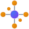

<p align="center">
  
</p>

# Svelte Periodic Table

[](https://app.netlify.com/sites/periodic-table/deploys)

## Usage

Copy the `src/lib/` folder into your Svelte project and import the `PeriodicTable` component:

```svelte
<script>
  import PeriodicTable from 'src/components/PeriodicTable.svelte'
</script>

<PeriodicTable />
```

## Props

Full list of props/bindable variables for this component:

- `showNames` (`boolean`, default: `true`): Whether to show element names in small text below the symbol.

## Want to contribute?

Clone the repo, install dependencies and start the dev server to try out your changes.

```sh
git clone https://github.com/janosh/periodic-table
cd periodic-table
yarn
yarn dev
```
